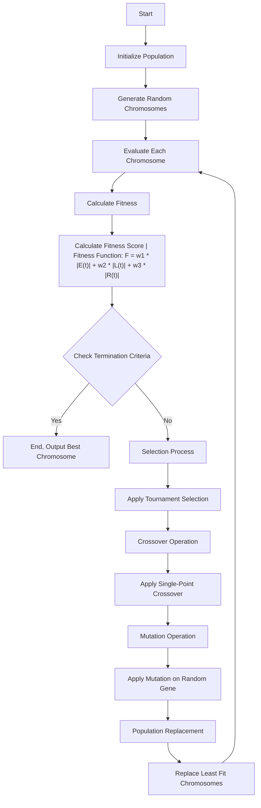

```mermaid
flowchart TB
    A[Start] --> B[Initialize Population]
    B --> C[Generate Random Chromosomes]
    C --> D[Evaluate Each Chromosome]
    D --> E[Calculate Fitness]
    E --> F1["Calculate Fitness Score | Fitness Function: F = w1 * |E(t)| + w2 * |L(t)| + w3 * |R(t)|"]
    F1 --> G{Check Termination Criteria}
    G -- Yes --> H[End, Output Best Chromosome]
    G -- No --> I[Selection Process]
    I --> J[Apply Tournament Selection]
    J --> K[Crossover Operation]
    K --> L[Apply Single-Point Crossover]
    L --> M[Mutation Operation]
    M --> N[Apply Mutation on Random Gene]
    N --> O[Population Replacement]
    O --> P[Replace Least Fit Chromosomes]
    P --> D
```